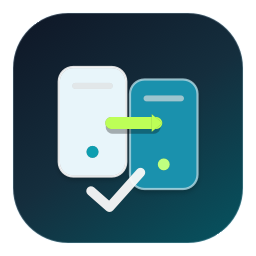

# DadCloner

<p align="center">
  
</p>

DadCloner is a tiny macOS menu bar app for automatic external drive backups. It uses `rsync`, remembers the exact source and backup drive UUIDs, and never deletes files from the backup. When something disappears from the source drive, DadCloner moves the backed-up copy into an archive folder instead.

Built for the kind of backup job where the safest restore path is "plug in the drive and browse normal files."

My dad's 75 and has decades of recording sessions and jingles on external drives. He needed backups that would actually happen without him thinking about it, and couldn't risk anything getting deleted. Time Machine was a non-starter. Mac OS 9 was his jam, his dock is longer than War and Peace. So, let's keep it dead simple:

## Download

Download the latest beta from the [GitHub Releases page](https://github.com/mikecerisano/DadCloner/releases).

DadCloner is currently beta software. Test it with non-critical folders or drives before using it for anything irreplaceable.

## How it works

Pick a source drive. Pick a backup drive. Set a schedule. Done.

The app syncs changes automatically using the bundled `rsync` binary. If a file gets removed from the source, the backed-up copy moves to a `DadCloner_Archive` folder on the backup instead of disappearing forever.

Everything lives in a `DadCloner Backup` folder on your destination drive:
- Mirrored files from source
- `DadCloner_Archive/` subfolder for anything that got removed

## Features

- Menu bar app for scheduled macOS backups
- Non-destructive backup behavior: no `--delete`
- Exact drive matching by volume UUID
- Free-space preflight before a backup starts
- Catch-up sync after missed schedules
- Visible status for mounted drives, running syncs, and failures
- Notarized Developer ID beta builds
- Bundled `rsync` 3.2.7; no Homebrew required

## What it doesn't do

- Touch your source drive (read only, always)
- Use `--delete` or any other destructive rsync flags
- Format or partition anything
- Require you to think about it after setup

## Current limitations

- Apple Silicon only for the public beta because the bundled `rsync` helper is arm64.
- Not a versioned backup system. It keeps the current mirrored copy plus archived files that disappeared from the source.
- No cloud sync, encryption, drive formatting, or network backup support.

## Building

Xcode 15+. The app bundles rsync 3.2.7 so it works without Homebrew.

The bundled rsync binary is currently Apple Silicon only. For Intel Macs, replace `DadCloner/Resources/rsync` with an x86_64 or universal rsync binary before building.
```bash
git clone [repo]
open DadCloner.xcodeproj
```

In Xcode:
1. Select the **DadCloner** target in the project navigator
2. Go to **Signing & Capabilities**
3. Set your **Team** to your Apple Developer account (or Personal Team for local builds)
4. Build and run

## Releasing

Use a Developer ID Application certificate for public builds. Sign the bundled `rsync` binary before re-signing and notarizing the app bundle.

Basic beta checklist:

```bash
xcodebuild -project DadCloner.xcodeproj -scheme DadCloner -configuration Release clean build
APP="path/to/DadCloner.app"
IDENTITY="Developer ID Application: Your Name (TEAMID)"
codesign --force --options runtime --timestamp --sign "$IDENTITY" "$APP/Contents/Resources/rsync"
codesign --force --options runtime --timestamp --entitlements DadCloner/DadCloner.entitlements --sign "$IDENTITY" "$APP"
codesign --verify --deep --strict --verbose=2 "$APP"
ditto -c -k --keepParent "$APP" DadCloner-0.1-beta.zip
xcrun notarytool submit DadCloner-0.1-beta.zip --keychain-profile "notarytool-profile" --wait
xcrun stapler staple "$APP"
spctl --assess --type execute --verbose=4 "$APP"
```

Do not ship a "Sign to Run Locally" build. The release artifact should show a Developer ID signature and a successful notarization result.

## License

MIT. Use it for your parents, rebuild it, whatever.
